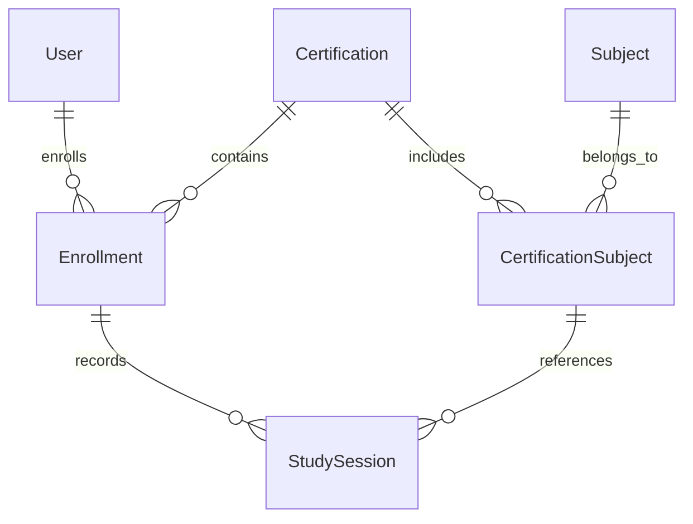

# PilotPath Architecture

## Overview

PilotPath is a modern platform designed to accompany pilots throughout their entire journey, from their first aviation certification to their professional career.

The first version focuses on study management and certification preparation, while future releases will expand the platform with operational tools, flight planning, logbooks, and career management features.

The application follows a modern full-stack architecture with a clear separation between presentation, business, persistence, and infrastructure layers.

---

# High Level Architecture

```text
                User
                  │
                  ▼
          Next.js Frontend
                  │
           REST / JSON API
                  │
                  ▼
          NestJS Backend
                  │
      Authentication Layer
                  │
           PrismaService
                  │
             Prisma ORM
                  │
                  ▼
            PostgreSQL
```

---

## Backend

### Technologies

- NestJS
- TypeScript
- Prisma ORM
- Passport
- JWT
- REST API

### Responsibilities

- Business logic
- Authentication & Authorization
- Request validation
- Database access
- API endpoints
- Error handling
- OpenAPI documentation

---

## Frontend

### Technologies

- Next.js
- React
- TypeScript
- Tailwind CSS
- shadcn/ui
- TanStack Query

### Responsibilities

- User interface
- Client-side routing
- API communication
- State management
- Form validation
- Authentication flow

---

## Authentication

Authentication is implemented using JWT-based authentication.

The authentication flow includes:

- User registration
- Password hashing
- JWT token generation
- JWT token validation
- Protected routes using guards

Protected endpoints use the `@Auth()` decorator, which applies JWT validation and role authorization.

---

## Database

### Technology

- PostgreSQL

### Current Core Entities

- User
- Certification
- Subject
- CertificationSubject
- Enrollment
- StudySession

### Planned Entities

- Question
- Flashcard
- MockExam
- Achievement
- Dashboard Statistics
- Flight Logbook
- Aircraft
- Airport

---

## Database Access Layer

The backend uses Prisma ORM as the database access layer.

Prisma is responsible for:

- Database connection management
- Type-safe queries
- Database migrations
- Schema management
- PostgreSQL communication

The application accesses the database through `PrismaService`, integrated with NestJS Dependency Injection.

---

## Shared Infrastructure

The backend contains reusable infrastructure components shared across modules.

Current shared components include:

- Pagination DTOs
- Pagination metadata handling
- Pagination utilities
- Common decorators
- Swagger helpers

These components provide consistency across paginated endpoints and reduce duplicated implementation across modules.

---

## Domain Model


Study sessions are linked to both an enrollment and a certification subject, ensuring every recorded study activity belongs to a specific certification and subject while allowing accurate progress tracking.

The PilotPath domain is centered around aviation certifications.

A user may enroll in multiple certifications throughout their career.

Each certification contains one or more subjects, and every study session is associated with both an enrollment and a certification subject, allowing accurate progress tracking across different certifications.

Certifications represent aviation milestones that users can pursue throughout their pilot career.

---

## API

PilotPath exposes a REST API using JSON over HTTP.

### Main Endpoints

```http
GET    /api/v1/health

POST   /api/v1/auth/register
POST   /api/v1/auth/login
GET    /api/v1/auth/me

GET    /api/v1/certifications
POST   /api/v1/certifications
GET    /api/v1/certifications/:id
PATCH  /api/v1/certifications/:id
GET    /api/v1/certifications/:id/subjects
POST   /api/v1/certifications/:id/enroll

GET    /api/v1/enrollments
GET    /api/v1/enrollments/:id

GET    /api/v1/subjects
POST   /api/v1/subjects

GET    /api/v1/study-history

POST   /api/v1/study-sessions
GET    /api/v1/study-sessions
GET    /api/v1/study-sessions/:id
```

The API is documented through OpenAPI (Swagger) and generated automatically from NestJS decorators.

---

## Architecture Principles

- Clean Architecture
- SOLID
- Separation of Concerns
- Feature-based modules
- Stateless authentication
- Database migrations
- Automated testing
- API-first development
- Documentation-first approach
- OpenAPI-first documentation