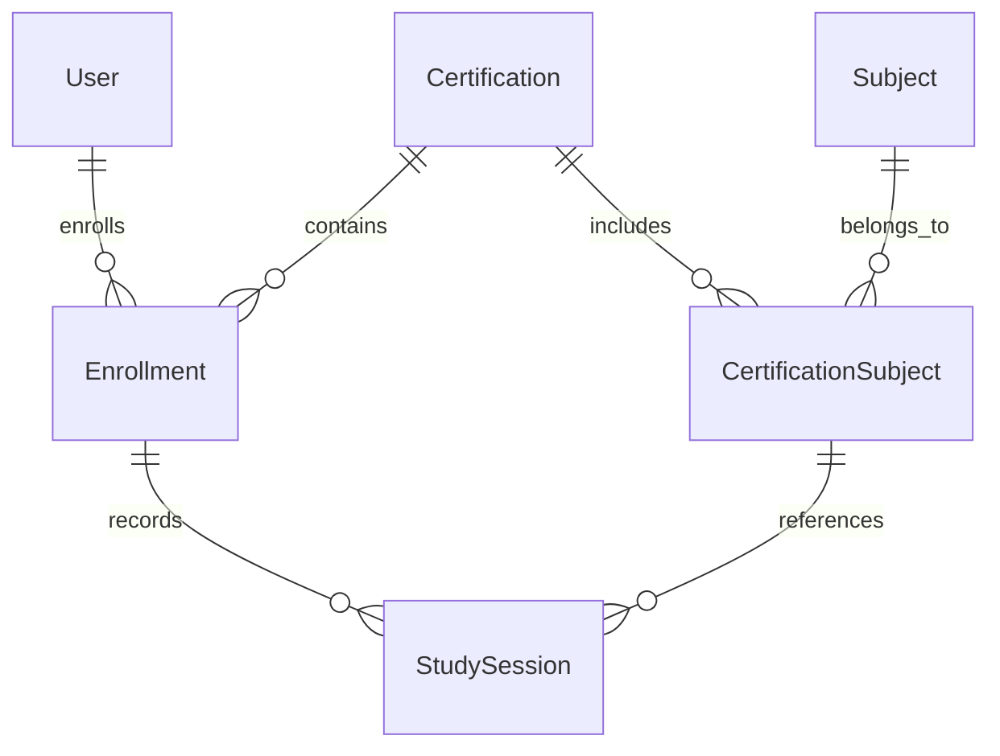

# PilotPath Architecture

## Overview

PilotPath is a modern aviation learning platform designed to help student pilots organize their studies, monitor their progress, and prepare for aviation certifications.

The application follows a modern full-stack architecture with a clear separation between frontend, backend, and database layers.

---

# High Level Architecture
          User
            │
            ▼
    Next.js Frontend
            │
      REST / JSON API
            │
            ▼
    NestJS Backend
            │
       PrismaService
            │
          Prisma ORM
            │
            ▼
      PostgreSQL
---

## Backend

### Technologies

- NestJS
- TypeScript
- Prisma ORM
- REST API

### Responsibilities

- Business logic
- Authentication & Authorization
- Validation
- Database access
- API endpoints
- Error handling

---

## Frontend

### Technologies

- Next.js
- React
- TypeScript
- Tailwind CSS
- shadcn/ui
- TanStack Query

### Responsibilities

- User interface
- Client-side routing
- API communication
- State management
- Form validation

---

## Database

### Technology

- PostgreSQL

### Current Core Entities

- User
- Certification
- Subject
- CertificationSubject
- Enrollment
- StudySession

### Planned Entities

- Question
- Flashcard
- MockExam
- Achievement
- Dashboard Statistics
- Flight Logbook
- Aircraft
- Airport
  
---

## Database Access Layer

The backend uses Prisma ORM as the database access layer.

Prisma is responsible for:

- Database connection management
- Type-safe queries
- Database migrations
- Schema management
- PostgreSQL communication

The application accesses the database through PrismaService, integrated with NestJS dependency injection.

## Domain Model

````md


The PilotPath domain is centered around aviation certifications.

A user may enroll in multiple certifications throughout their career. Each certification contains one or more subjects, and every study session is associated with both an enrollment and a certification subject, allowing accurate progress tracking across different certifications.

---

## API

PilotPath exposes a REST API using JSON.

### Example Endpoints

```http
GET    /api/v1/subjects
POST   /api/v1/study-sessions
GET    /api/v1/dashboard
```

---

## Architecture Principles

- Clean Architecture
- SOLID
- Separation of Concerns
- Feature-based modules
- Database migrations
- Automated testing
- API-first development
- Documentation-first approach