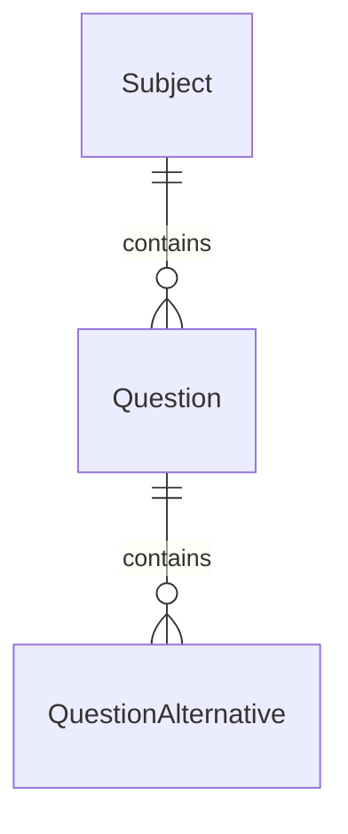

# Question Bank

## Overview

The Question Bank module provides aviation questions used for certification preparation.

Questions are organized by subjects and contain multiple alternatives with a defined correct answer and optional explanation.

---

## Entities

### Question

Represents an aviation knowledge question.

Properties:

- Statement
- Subject association
- Difficulty level
- Explanation
- Active status

---

### QuestionAlternative

Represents possible answers for a question.

Properties:

- Letter identifier
- Alternative content
- Correct answer flag

Each question can contain multiple alternatives, but only one should be marked as correct.

---

## Relationships



---

## API

### Create Question

```http
POST /api/v1/questions
```

Creates a new aviation question.

Authentication:

- ADMIN only

### List Questions

```http
GET /api/v1/questions
```

Returns available questions.

Authentication:

- Authenticated users

### Get Question

```http
GET /api/v1/questions/:id
```

Returns question details including alternatives.

Authentication:

- Authenticated users

### Future Improvements

- Question categories
- Exam simulation
- Question randomization
- Difficulty balancing
- User performance analytics