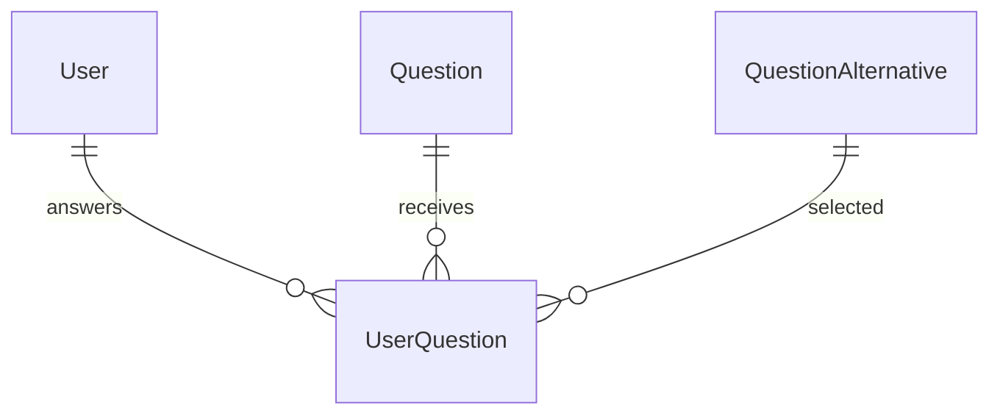

# Question Practice

## Overview

Question Practice allows users to answer aviation questions and track their learning performance.

Each answer attempt is stored, enabling statistics and adaptive learning features through the Learning Analytics API.

---

## Entities

### UserQuestion

Stores a user's answer attempt.

Properties:

- User
- Question
- Selected alternative
- Correctness
- Response time
- Answer date

---

## Relationships



---

## API

### Submit Answer

```http
POST /api/v1/questions/:id/answer
```

Features:

- Validate selected alternative
- Calculate correctness
- Store response time
- Persist answer history

Authentication:

- Authenticated users

### Answer History

```http
GET /api/v1/questions/history
```

Returns previous answers from the authenticated user.

### Analytics

Question performance is available through:

```http
GET /api/v1/learning/statistics/questions
```

### Future Improvements

- Dedicated question practice UI
- Adaptive difficulty
- Study recommendations
